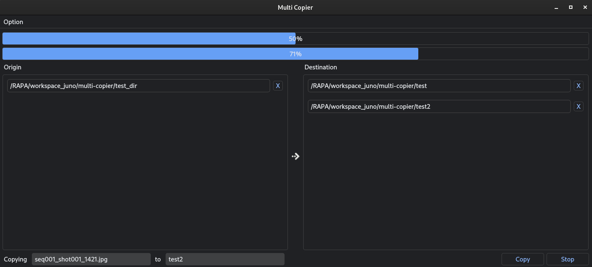

# Multi Copier
Multi Copier is a PySide2-based GUI application designed for efficiently copying files and directories to multiple destination paths. This tool simplifies the process of copying large sets of files while providing real-time progress updates and options for interruption and notifications.

## Table of Contents
- [Features](#features)
- [Installation](#installation)
- [Usage](#usage)
- [How to use](#how-to-use)
- [Code Structure](#code-structure)
- [License](#license)
- [Contributing](#contributing)

## Features
- **Drag and Drop Interface**: Easily add files or directories by dragging and dropping from your file explorer.

- **Multiple Destination Paths**: Define multiple destination paths for simultaneous copying.
- **Real-time Progress Updates**: Track overall progress and individual file progress during copying.
- **Stop Functionality**: Interrupt copying process anytime with a stop button.
- **Notifications**: Options to send email notifications or messages to RocketChat upon completion (dummy functionality).

<center>



</center>

## Installation
To use Multi Copier, Python and a few dependencies need to be installed on your system:

- PySide2
- pyqtdarktheme

You can install these dependencies using pip:

```bash
pip install PySide2 pyqtdarktheme
```

Clone the repository and navigate to the project directory:

```bash
git clone https://github.com/junopark00/multi-copier.git
cd multi-copier
```

## Usage
Run the application by executing the main script:

```bash
python ./copier.py
```

## How to Use
- Add Files/Directories:
  - Drag and drop files or directories into the "Origin" section.
  - Files or directories will be listed with their full paths.

- Add Destination Paths:
  - Drag and drop directories into the "Destination" section.
  - Multiple destination paths can be defined for simultaneous copying.

- Start Copying:
  - Click on the "Copy" button to start copying files.
  - Progress bars will update in real-time, showing overall and individual file progress.

- Stop Copying:
  - Click on the "Stop" button to interrupt the copying process.

## Code Structure
- `copier.py`: Main script to run the application.

- `copier_ui.py`: Defines the CopierUI class for setting up the GUI.

## License
This project is licensed under the MIT License. See the LICENSE file for details.

## Contributing
Welcome contributions to multi-renamer.

To contribute:

1. Fork the repository.
2. Create a new branch (git checkout -b feature/your-feature-name).
3. Make your changes.
4. Commit your changes (git commit -m 'Add some feature').
5. Push to the branch (git push origin feature/your-feature-name).
6. Open a pull request.Contributions are welcome! Please open an issue or submit a pull request on GitHub.